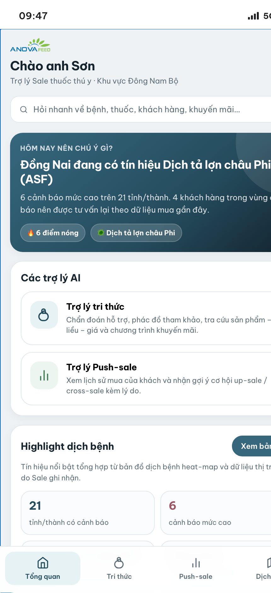
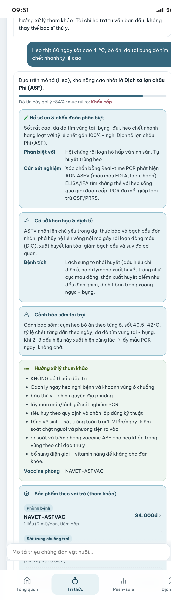
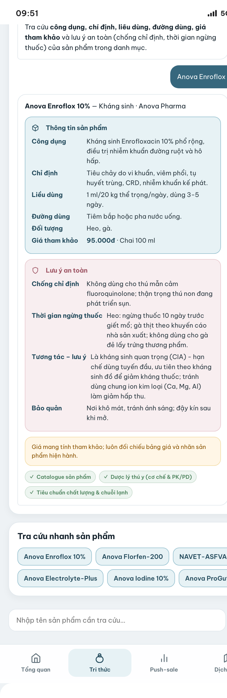
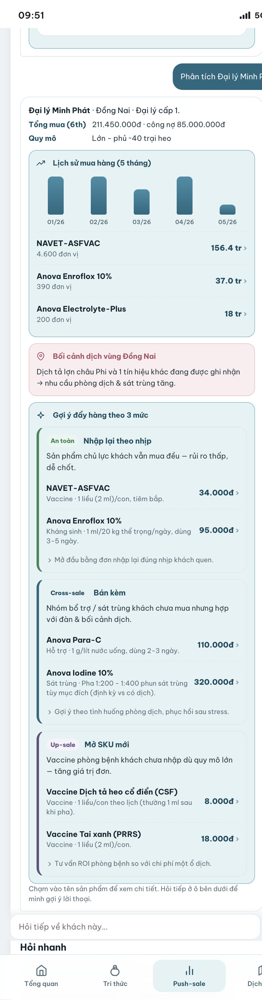
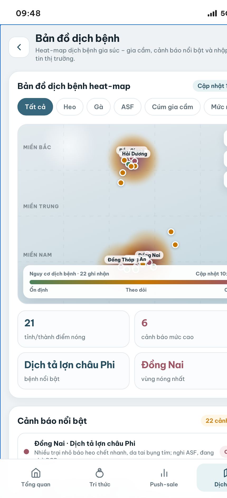
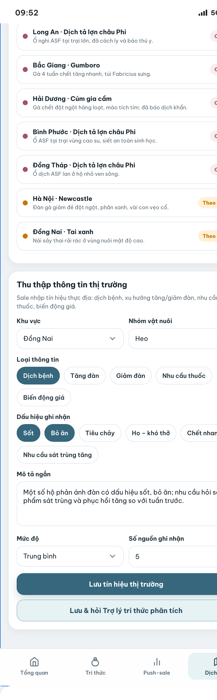
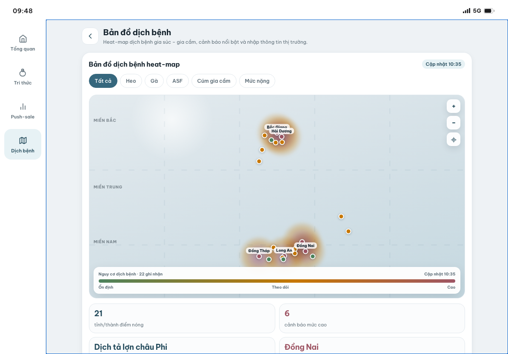

# AI SalesMate — Mobile (AI4Sales)

Phiên bản **mobile / tablet** của AI4Sales dành cho nhân viên Sale cầm đi hiện trường.
Tổng hợp dữ liệu & flow từ bản desktop `AI4Sales/`, làm lại UI mobile-first theo bộ nhận
diện **Anova** (tông slate `#36677D`, font *Be Vietnam Pro*, logo Anova).

> Web tĩnh thuần, **không backend / không API key / không thư viện ngoài** — mọi câu trả lời
> sinh từ dữ liệu nhúng trong `data.js`. Mở là chạy, offline.

## Chạy thử
Mở trực tiếp `index.html` bằng trình duyệt (double-click cũng được).

**Tự thích ứng theo thiết bị** (nhận diện cảm ứng bằng `pointer: coarse` / `maxTouchPoints` → gắn class `touch` cho `<html>`):
- **iPhone** — app tràn toàn màn hình; Dynamic Island & home indicator nhường cho phần cứng máy.
- **iPad dọc** — full-screen, nội dung căn giữa cho dễ đọc, **lưới 2 cột**, bản đồ lớn hơn.
- **iPad ngang** — full-screen với **thanh điều hướng dọc bên trái** (kiểu app tablet).
- **Máy tính** — hiển thị trong **khung iPhone 17 mô phỏng** (Dynamic Island + viền titanium) để xem thử.

Deep-link nhanh tới từng tab: `index.html#knowledge`, `#push`, `#market`.

---

## Ảnh màn hình

| Tổng quan | Trợ lý tri thức — Chẩn đoán | Tra cứu sản phẩm |
|:--:|:--:|:--:|
|  |  |  |

| Trợ lý Push-sale | Bản đồ dịch bệnh | Thu thập thông tin thị trường |
|:--:|:--:|:--:|
|  |  |  |

**iPad ngang — thanh điều hướng dọc bên trái (kiểu app tablet)**



> Ảnh chụp từ chính app (Chrome). Tự sinh lại bất kỳ lúc nào bằng cách mở các màn hình tương ứng.

---

## Điều hướng — 4 màn hình

Thanh tab dưới (hoặc rail bên trái khi iPad ngang): **Tổng quan · Tri thức · Push-sale · Dịch bệnh**.

### 0. Tổng quan (`home`)
Màn mở đầu, mọi thẻ đều bấm được:
- **Lời chào + khu vực phụ trách**; chuông 🔔 → mở danh sách **cảnh báo dịch mức cao**.
- Thẻ **"Hôm nay nên chú ý gì?"** (tự tổng hợp từ cảnh báo) → chạm để vào bản đồ.
- 2 thẻ **trợ lý AI** → vào tab Tri thức / Push-sale.
- **Highlight dịch bệnh**: 4 chỉ số tính từ dữ liệu cảnh báo (số tỉnh điểm nóng, cảnh báo mức cao, bệnh ghi nhận nhiều nhất, vùng nguy cơ cao).
- **Gợi ý câu hỏi nhanh** → chạm là chạy thẳng vào đúng luồng (chẩn đoán / sản phẩm / khuyến mãi / phân tích khách / bản đồ).

### 1. Trợ lý tri thức (`knowledge`) — AI chat
Khung chat (bong bóng hội thoại). 4 luồng chọn bằng tab phía trên; gõ tự do thì **tự định tuyến theo ý định**:
- **Chẩn đoán dịch bệnh** — mô tả triệu chứng → bệnh khả năng nhất + **độ tin cậy**, chẩn đoán phân biệt, mức rủi ro, cơ sở khoa học/dịch tễ, cảnh báo sớm, **phác đồ tham khảo**, **sản phẩm theo vai trò (kèm liều & giá)**, **cờ chuyển chuyên gia** + lưu ý an toàn.
- **Phác đồ** — chọn bệnh → các bước xử lý + vaccine phòng + nhóm sản phẩm đi kèm (dẫn nguồn thư viện tri thức).
- **Tra cứu sản phẩm** — công dụng, chỉ định, liều dùng, đường dùng, **giá**, quy cách, lưu ý an toàn (chống chỉ định, thời gian ngừng thuốc).
- **Khuyến mãi** — các chương trình đang áp dụng (đối tượng, ưu đãi, điều kiện).

### 2. Trợ lý Push-sale (`push`) — AI chat
Cũng là khung chat như tab Tri thức:
1. Mở tab → bong bóng AI chào + **"Gợi ý ưu tiên hôm nay"** (chạm tên khách để phân tích).
2. **Chọn khách hàng** (chip phía trên hoặc gõ tên) → AI trả lời trong luồng chat: **lịch sử mua** (tổng mua, công nợ, biểu đồ theo tháng, sản phẩm chủ lực), **bối cảnh dịch vùng**, và **gợi ý đẩy hàng 3 mức** — *An toàn* (nhập lại theo nhịp) → *Cross-sale* (bán kèm nhóm chưa mua) → *Up-sale* (mở SKU/vaccine mới).
3. **Hỏi tiếp** ngay trong chat: AI trả lời theo ý định — *"khách kêu giá cao nói sao"*, *"nên bán kèm gì"*, *"vì sao gợi ý vaccine này"*, *"lịch sử mua"*, *"công nợ"*, hoặc gợi ý **lời thoại gọi khách + xử lý từ chối**.

### 3. Bản đồ dịch bệnh (`market`)
- **Heat-map** gia súc – gia cầm: chấm cảnh báo chiếu theo **toạ độ thật** của tỉnh/thành (lat/lng), tô vùng nhiệt theo mức độ, dải vùng Bắc/Trung/Nam.
- **Lọc** theo vật nuôi / bệnh / mức nặng; **zoom** thật bằng nút `+` `−` và `⌖` (phóng vào khu vực phụ trách); chạm chấm → chi tiết cảnh báo.
- Dashboard thống kê + danh sách **cảnh báo nổi bật** (chạm để soi trên bản đồ).
- Nút **"Thu thập thông tin thị trường"**: Sale nhập dịch bệnh / xu hướng đàn / nhu cầu thuốc / biến động giá… → **lưu tín hiệu, cập nhật ngay bản đồ + dashboard**; có nút "Lưu & hỏi Trợ lý tri thức phân tích".

---

## Tương tác (mọi nút đều chạy thật)
- **Chạm bất kỳ sản phẩm nào** (trong câu trả lời chẩn đoán/phác đồ, hoặc gợi ý Push-sale) → mở **bottom sheet chi tiết sản phẩm** (công dụng, liều, giá, lưu ý an toàn, nguồn).
- **Chuông 🔔** → sheet danh sách cảnh báo nặng. **Thẻ hero** trên Tổng quan → bản đồ.
- **Gợi ý nhanh** ở mỗi tab đổi theo ngữ cảnh; gõ câu hỏi tự do được định tuyến đúng luồng.

---

## Cấu trúc
```
AI4Sales-Mobile/
├── index.html          # khung 4 màn hình + điều hướng + nhận diện thiết bị cảm ứng
├── styles.css          # bộ nhận diện Anova, responsive iPhone/iPad/desktop
├── app.js              # toàn bộ logic & các engine sinh câu trả lời từ window.DB
├── data.js             # dữ liệu nhúng (sinh từ AI4Sales/data — không sửa tay)
├── assets/             # logo Anova
├── README.md           # tài liệu này
└── GIT-CHEATSHEET.md   # sổ tay cú pháp Git của dự án
```
> Triển khai lên GitHub Pages: xem `../docs/md/06-trien-khai/DEPLOY-AI4Sales-Mobile.md`.

## Dữ liệu
Nhúng từ `AI4Sales/data` vào `window.DB`: **14 bệnh · 19 sản phẩm · 4 NPP · 22 cảnh báo · 58 tỉnh · 4 chương trình KM**.
Đây là dữ liệu mẫu để chạy luồng; khi triển khai thật chỉ cần thay catalogue/KB/CRM,
**giữ nguyên schema**. Muốn cập nhật `data.js`, sinh lại từ thư mục `AI4Sales/data`.

> Ứng dụng chỉ hỗ trợ tư vấn — **không tạo đơn, không chốt đơn, không thay thế bác sĩ thú y**.
